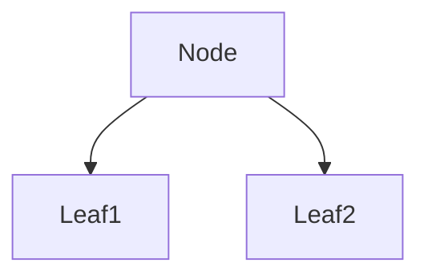

A.K.A. Adaptive Boosting

Developed by Freund and Schapire, 1995. 
It was designed to improve the performance of binary classifiers. 

In a [[Random Forest]] each decision tree is made independently of the others, and each tree has an equal vote on the outcome. Each tree is a full decision tree. 

Conversely in AdaBoost: 
1) The forest is made from **stumps** (one node and two leaves) which are weak learners. 
2) Some stumps have more say in the output decision than others. 
3) Each stump is made by taking the previous stumps mistakes into account. 

This is a stump.

## Psuedo Code

- Each observation is given an equal sample weight.

- Use each feature to create a stump that predicts the outcome. 
  Calculate the Gini Index for each, and select the one with the lowest Gini Index. 

- Determine the weight of the stump's vote based on its **Total Error**. Total Error (0-1) is the sum of the weights of the observations it incorrectly classified. 

- There is then an equation to use to calculate how much say this stump will have. 

	$Amount of Say = \frac{1}{2} log( \frac{1- Total Error}{Total Error})$
	
	Note: this equation will not work for TE = 0 or 1 so you can add a small error term for those. 

- We now need to recalibrate the sample weights: 
	- Incorrectly classified samples: `sampleweight x` $e^{Amount of Say}$
	- Correctly classified samples: `sampleweight x` $e^{-Amount of Say}$
	- Normalise the weights so they all add up to one.

- Now we make a new dataset for the next stump. Choose a random number between 0 and 1 and imagine the sample weights have a cumulative column count. The ones with bigger weights will take up more space, so random number generation is more likely to pick them. We use resampling so they can be picked multiple times, and end up with a dataset the same size as the original, that probably contains a few copies of the higher weighted observations.
  
- All these samples are given equal weight. 

- Start again!

The model then makes classifications by taking the classifications from all stumps, weighting their vote by `Amount of Say` and comparing the total sum of the votes for each option. Go with the biggest value. 

---

[AdaBoost Clearly Explained by StatQuest](https://www.youtube.com/watch?v=LsK-xG1cLYA&list=PLblh5JKOoLUICTaGLRoHQDuF_7q2GfuJF&index=58)

